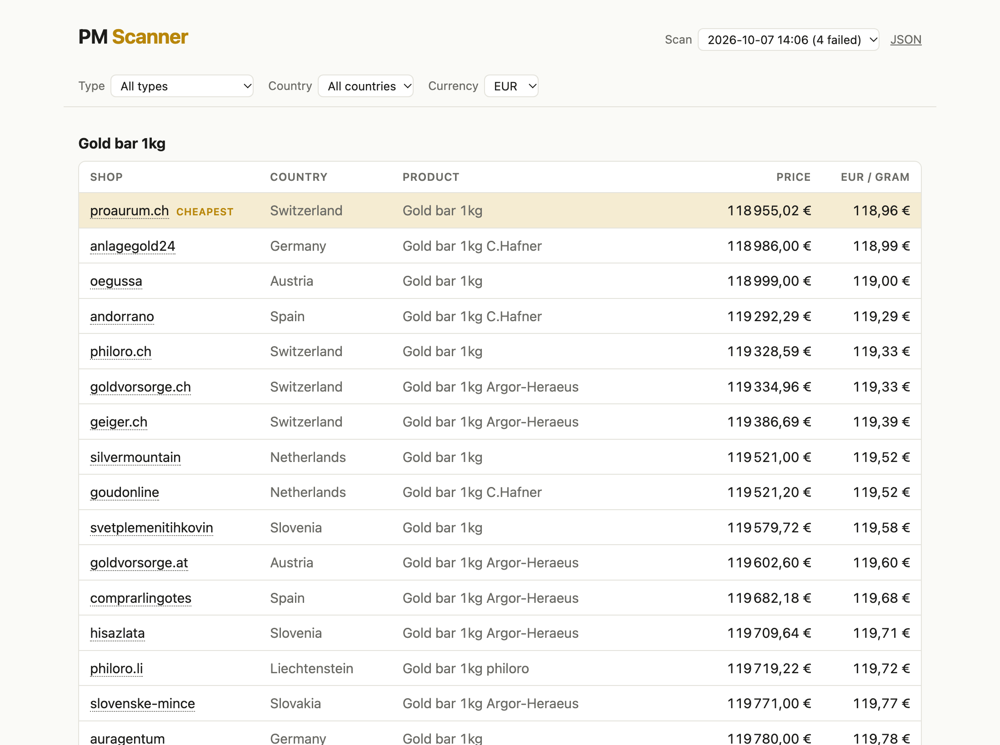

# PMScanner

[](https://github.com/UyttenhoveSimon/PMScanner/actions/workflows/ci.yml)
[](go.mod)
[](LICENSE)

**Compare precious-metal prices across European bullion dealers, ranked by price per gram.**

PMScanner scrapes gold and silver product pages from many dealers at once and tells
you who sells cheapest, either as a terminal table or as a small self-hosted web page.



```
SITE           PRODUCT                PRICE          PER GRAM  URL
or.fr          Gold bar 1kg Valcambi  119856.23 EUR  119.86    https://or.fr/achat/or/lingots/...
hollandgold    Gold bar 1kg Heraeus   119989.86 EUR  119.99    https://www.hollandgold.nl/...
stonexbullion  Gold Krugerrand 1oz    3730.60 EUR    119.94    https://stonexbullion.com/fr/...
...
```

## Features

- **No per-site scraping code.** Prices come from the schema.org data shops publish
  for search engines (JSON-LD, microdata, Open Graph), so redesigns rarely break it.
- **Fast.** All pages are fetched concurrently; a full scan takes about 25 seconds.
- **Works behind bot walls.** Shops protected by Cloudflare or similar are loaded in
  a headless Chromium-based browser.
- **History.** Every scan is saved in a small SQLite database, and past scans can be
  browsed on the web page or through the JSON API.
- **Web page and JSON API.** `-serve` starts a page that rescans once a day in the
  background.
- **Easy to extend.** Adding a shop is usually one line in [`products.go`](products.go).

## Quick start

Requires [Go 1.27+](https://go.dev/dl/).

```sh
git clone https://github.com/UyttenhoveSimon/PMScanner.git
cd PMScanner
go run .
```

### Build a binary

The web page is embedded, so the binary is self-contained. Without cgo it can
be cross-compiled for any platform:

```sh
CGO_ENABLED=0 go build -trimpath -ldflags="-s -w" -o pmscanner .
./pmscanner -serve :8080

# e.g. for a Linux server or a Raspberry Pi
GOOS=linux GOARCH=amd64 CGO_ENABLED=0 go build -trimpath -ldflags="-s -w" -o pmscanner-linux-amd64 .
GOOS=linux GOARCH=arm64 CGO_ENABLED=0 go build -trimpath -ldflags="-s -w" -o pmscanner-linux-arm64 .
```

### Web page

```sh
go run . -serve :8080
```

Open <http://localhost:8080>. Prices are grouped by product with the cheapest
offer highlighted. The bar at the top filters by product **Type** and shop **Country**, and converts
all prices to another **Currency** on the fly (ECB rates); both choices are
remembered. Use the **Scan** menu to look at a past scan.

The server rescans once a day, counting from the last saved scan, so restarting
it does not trigger a new scan.

| Flag       | Default        | Description                                               |
| ---------- | -------------- | --------------------------------------------------------- |
| `-serve`   |                | Address to serve the web page on, e.g. `:8080`            |
| `-refresh` | `24h`          | How often the server rescans; `0` disables automatic scans |
| `-db`      | `pmscanner.db` | SQLite database where every scan is saved                 |

| Endpoint               | Description                       |
| ---------------------- | --------------------------------- |
| `/`                    | Price tables of the latest scan   |
| `/?scan=ID`            | Price tables of a past scan       |
| `/api/scans`           | List of saved scans as JSON       |
| `/api/prices`          | Latest scan as JSON               |
| `/api/prices?scan=ID`  | A past scan as JSON               |

Running `go run .` without `-serve` also saves its scan to the database.

### Static site and GitHub Pages

`-export DIR` writes the web page for every saved scan as plain files
(`index.html`, `scans/ID.html`, `api/*.json`), without scanning:

```sh
go run . -export site
```

The [Pages workflow](.github/workflows/pages.yml) does this every day on GitHub:
it scans, keeps the database on the `data` branch, and publishes the result to
GitHub Pages. It can also be run by hand from the Actions tab.

Some shops block GitHub's servers. To scan from your own machine and publish
the result instead, run:

```sh
scripts/publish-local.sh
```

It adds the scan to the published database on the `data` branch and asks the
Pages workflow to republish the site without scanning again (requires `gh`).

### Browser mode

Products marked `Browser: true` need a Chromium-based browser (Chrome, Chromium,
Brave or Edge). It is found automatically; to use another one:

```sh
PMSCANNER_BROWSER="/path/to/browser" go run .
```

## Adding a shop

Add an entry to [`products.go`](products.go):

```go
{Site: "myshop", Country: "BE", Description: "Gold Krugerrand 1oz", WeightGrams: oz,
    URL: "https://myshop.example/krugerrand-1oz"},
```

Start the description with one of the product categories listed in
[`page.go`](page.go) (`Gold bar 1kg`, `Gold Krugerrand 1oz`, `Gold Vreneli 20 CHF`,
`Gold Sovereign`, …) to group it on the web page. `WeightGrams` is the **fine**
metal content, e.g. 5.806 g for a Vreneli, so all products compare per gram of
pure gold. If the price doesn't come out right, these options help:

| Field       | Use when                                                                  |
| ----------- | ------------------------------------------------------------------------- |
| `Sources`   | The shop's first data source holds the wrong price (e.g. a buy-back price) |
| `Selectors` | The shop has no structured data; give CSS selectors for the price element  |
| `Cookies`   | The shop needs a cookie, e.g. to show prices in EUR                        |
| `Browser`   | The shop blocks plain HTTP clients with a JavaScript challenge            |
| `VAT`       | The price isn't the default for its metal: `VATMargin`, `VATExcluded` (VAT is added when comparing) or `VATFree` |
| `Currency`  | The page shows prices without a currency                                  |

## Taxes

Prices per gram compare what you actually pay. Investment gold is VAT exempt in
the EU, the UK and Switzerland; other metals include VAT, and for shops that
quote prices without VAT the country's standard rate (from [`tax.go`](tax.go))
is added. Each price is labelled accordingly, and the page ends with a table
of the tax rules in every country it covers.

## Exchange rates

Prices are ranked in euros, converted at the exchange rate of the day of each
scan. Rates are the European Central Bank's daily euro reference rates; for
currencies the ECB does not publish (e.g. RUB, AZN, KZT, RSD) they come from
[open.er-api.com](https://www.exchangerate-api.com/docs/free). The page names
the source of every currency it offers.

## How it works

For each product page, PMScanner tries these sources in order and keeps the first price found:

1. `Selectors`, if the product defines any
2. JSON-LD: `<script type="application/ld+json">` with a schema.org `Offer`
3. Microdata: `itemprop="price"`
4. Open Graph: `<meta property="product:price:amount">`

```
.
├── main.go          # CLI: scan and print the table
├── web.go, web.html # -serve: web page and JSON API
├── products.go      # the list of shops and products
├── scraper/         # fetching (HTTP or headless browser) and price extraction
├── fx/              # conversion to euros with ECB reference rates
└── store/           # SQLite storage of every scan
```

## Contributing

Issues and pull requests are welcome, especially new dealers. Before opening a PR:

```sh
gofmt -l . && go vet ./... && go test ./...
```

## Disclaimer

Prices are scraped from public pages and may be delayed or wrong. Always check the
dealer's site before buying. Respect each site's terms of use.

## License

[MIT](LICENSE)
